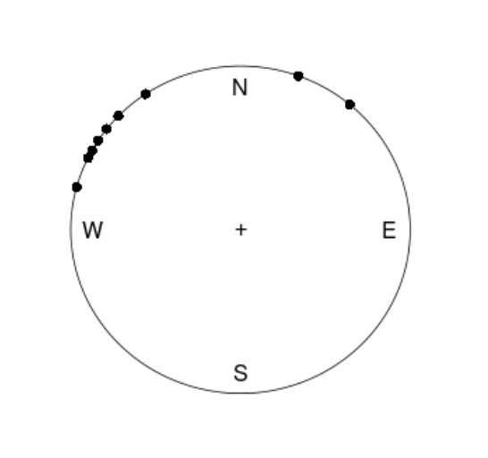

```{r setup, include=FALSE}
knitr::opts_chunk$set(echo = TRUE)
library(ggplot2)
library(geoR)
```

# Bernoulli

**Exercise:** Let $y_1, ..., y_n | \theta \sim  \text{Bern}(\theta)$, and assume that you have obtained a sample with $s = 14$ successes in $n = 20$ trials. Assuma a $\text{Beta}(\alpha_0, \beta_0)$ prior for $\theta$ and let $\alpha_0 = \beta_0 = 2$.

a) Draw random numbers from the posterior distribution $\theta|y \sim \text{Beta}(\alpha_0 + s, \beta_0 + f), y = (y_1,...,y_n)$, and verify that the posterior mean and standard deviation converges to the true values as the number of random draws grows large.

b) Use simulation (`nDraws = 10000`) to compute the posterior propability $\text{Pr}(\theta < 0.4|y)$ and compare with the exact value [Hint: `pbeta()`].

c) Compute the posterior distribution of the log-odds $\phi = log\left(\frac{\theta}{1 - \theta}\right)$ by simulation (`nDraws = 10000`). [Hint: `hist()` and `density` might come in handy]

## Drawing from the Posterior

First we define the parameters as we need them later.

```{r}

################################################################################
# Exercise 1.a)
################################################################################

# Parameters
n = 20
s = 14
f = n - s

# Prior
alpha_z = 2
beta_z = 2

# Posterior
alpha_post = alpha_z + s
beta_post = beta_z + f

```

The posterior is given as Beta($\alpha_n$, $\beta_n$) where $\alpha_n = \alpha_0 + s$ and $\beta_n = \beta_0 + f$. Therefore the theoretical mean is given by:

$$\text{E}[X] = \frac{\alpha_n}{\alpha_n + \beta_n}$$
And the standard deviation by:

$$\text{sd}[X] = \sqrt{\frac{\alpha_n \beta_n}{(\alpha_n + \beta_n)^2(\alpha_n + \beta_n + 1)}}$$

So let's calculate this.

```{r}

mean_posterior = alpha_post / (alpha_post + beta_post)
sd_posterior = sqrt((alpha_post * beta_post) /
                  ((alpha_post + beta_post)^2 * (alpha_post + beta_post + 1))) 

```

Therefore the mean of the prior is given by $`r mean_posterior`$ and the standard deviation by $`r sd_posterior`$.

Now we will create a function that calculates the mean and standard deviation for a given number of trials to plot it later on.

```{r}

get_stats = function(n, alpha, beta) {
  samples = rbeta(n, alpha, beta)
  return(c(count = n, sample_mean = mean(samples), sample_sd = sd(samples)))
}

df = data.frame(t(sapply(2:10000, get_stats, alpha_post, beta_post)))

```

```{r, echo = FALSE}

ggplot(df) +
  geom_line(aes(x = count, y = sample_mean, color = "Standard Mean")) +
  geom_line(aes(x = count, y = mean_posterior, color = "True Mean")) +
  labs(title = "Mean with Increasing Drawns", y = "Mean", x = "Draws") +
  scale_color_manual("Legend", values = c("#C70039", "#000000")) +
  theme_minimal()

```

```{r, echo = FALSE}

ggplot(df) +
  geom_line(aes(x = count, y = sample_sd, colour = "Standard Deviation")) +
  geom_line(aes(x = count, y = sd_posterior, colour = "True Standard Deviation")) +
  labs(title = " Standard Deviation with Increasing Drawns",
       y = "Standard Deviation", x = "Draws") +
  scale_color_manual("Legend", values = c("#0039C7", "#000000")) +
  theme_minimal()

```

We can see that the posterior mean and standard deviation converge as the nimber of random draws grows. 

## $Pr(\theta < 0.4 | y)$

The true probability is calculated by calling `pbeta(0.4, alpha_post, beta_post)` which is `r pbeta(0.4, alpha_post, beta_post)`.

We will simulate by taking samples and counting how many of them are < $0.4$.

```{r}

################################################################################
# Exercise 1.b)
################################################################################

mean(rbeta(100000, alpha_post, beta_post) < 0.4)

```

As we can see both values are quite close to each other.

## Log-Odds

The log-odds are given by

$$\Phi = \text{log} \left( \frac{\theta}{1 - \theta} \right)$$
where $\theta$ are samples drawn from the posterior. We can therefore easily calculate the value by:

```{r}

################################################################################
# Exercise 1.c)
################################################################################

draws = 10000

samples = rbeta(draws, alpha_post, beta_post)
phi = log(samples / (1 - samples))

```

The distribution looks as follows:

```{r, echo = FALSE}

phi = data.frame(phi)
colnames(phi) = "phi"

ggplot(phi) +
  geom_histogram(aes(x = phi, y=..density..), color = "black",
                 fill = "#dedede", bins = sqrt(draws)) +
  geom_density(aes(x = phi, y=..density..), color = "#0039C7") +
  labs(title = "Histrogram of Log-Odds",
  y = "Density",
  x = "Log-Odds", color = "Legend") +
  theme_minimal()

```

# Log-Normal Distribution and the Gini Coefficient

Assume that you have asked 10 randomly selected persons about their monthly in- come (in thousands Swedish Krona) and obtained the following ten observations: 14, 25, 45, 25, 30, 33, 19, 50, 34 and 67. A common model for non-negative continuous variables is the log-normal distribution. The log-normal distribution log $\mathcal{N}(\mu, \sigma^2)$ has density function

$$p(y|\mu, \sigma^2) = \frac{1}{y \sqrt{2\pi\sigma^2}} \text{exp}\left[ - \frac{1}{2\sigma^2} (\text{log}(y) - \mu)^2 \right]$$

for $y > 0$, $\mu > 0$, and $\sigma^2 > 0$. The log-normal distribution is related to the normal distribution as follows: if $y \sim \mathcal{N}(\mu, \sigma^2)$ then log $y\sim \mathcal{N}(\mu, \sigma^2)$. Let $y_1,...,y_n|\mu,\sigma^2$, where $\mu = 3.5$ is assumed to be known but $\sigma^2$ unknown with non-informative prior $p(\sigma^2) \propto 1/\sigma^2$. The posterior for $\sigma^2$ is the $Inv-\chi^2(n, \tau^2)$ distribution where

$$\tau^2 = \frac{\sum_{i=1}^{n} (\text{log} \; y_i - \mu)^2 }{n}.$$

a) Simulate 10.000 draws from the posterior of $\sigma^2$ (assuming $\mu = 3.5$) and compare with the theoretical $Inv-\chi^2(n, \tau^2)$ posterior distribution.

b) The most common measure of income inequality is the Gini coefficient, G, where $0 \leq G \leq 1$. $G = 0$ means a completely equal income distribution, whereas $G = 1$ means complete income inequality. See Wikipedia for more information. It can be shown that $G = 2\Phi(\sigma/\sqrt{n})-1$ when incomes follow a $\text{log} \;\mathcal{N}(\mu, \sigma^2)$ distribution. $\Phi(z)$ is the cumulative distribution function (CDF) for the standard normal distribution with mean zero and unit variance. Use the posterior draws in a) to compute the posterior distribution of the Gini coefficient G for the current data set.

c) Use the posterior draws from b) to compute a 95% equal tail credible interval for G. An 95% equal tail interval (a, b) cuts off 2.5% percent of the posterior probability mass to the left of a, and 97.5% to the right of b. Also, do a kernel density estimate of the posterior of G using the `density` function in R with default settings, and use that kernel density estimate to compute a 95% Highest Posterior Density interval for G. Compare the two intervals.

## Simulate Draws from the Posterior Distribution

We calculate $\tau^2$, then we sample from `rinvchisq()` and compare the drawn samples to the desnity function given by `dinvchisq()`.

```{r}

################################################################################
# Exercise 2.a)
################################################################################

obs = c(14, 25, 45, 25, 30, 33, 19, 50, 34, 67)
n = length(obs)
mu = 3.5
tau_sq = (sum((log(obs) - mu)^2)) / (n)

samples = rinvchisq(10000, n, tau_sq)
X = seq(from = 0, to = 4, length.out = 1000)
Y = dinvchisq(X, n, tau_sq)

```

```{r, echo = FALSE, eval = FALSE}

################################################################################
# Exercise 2.a) ALTERNAIVE
################################################################################

y <- c(14, 25, 45, 25, 30, 33, 19, 50, 34, 67)
n <- length(y)

mu <- 3.5
tau_sq <- sum((log(y) - mu)^2)/n

samples <- rchisq(10000, n)

# Posterior of sigma square
sigma_sq <- (n * tau_sq)/samples

# Mean and sd
sigmasq_mean <- mean(sigma_sq)
sigmasq_sd <- sd(sigma_sq)

# True mean and sd for inverse chi square
invchisq_mean <- n * tau_sq/(n - 2)
invchisq_sd <- sqrt(((2*n^2) * tau_sq^4) / (((n - 2)^2) * (n - 4)))

# Probability density function for inverse chi square
invchisq <- function(y, n, tau_sq){
  return(((((tau_sq*n)/2)^(n/2))/gamma(n/2)) *
           ((exp((-n*tau_sq)/(2*y)))/y^(1+n/2)))
}

# Plotting simulated posterior distribution.
ggplot(as.data.frame(sigma_sq), aes(x = sigma_sq)) +
  geom_histogram(aes(y=..density..),colour="black",bins=50) +
  stat_function(fun = invchisq, args = list(n=n,tau_sq=tau_sq),colour="red") +
  ggtitle("Plot of simulated posterior distribution") +
  theme_bw() + 
  theme(plot.title = element_text(hjust = 0.5), legend.position = "right")

################################################################################
# Exercise 2.a) ALTERNATIVE END
################################################################################

```

We can see hat the drawn samples for $\sigma^2$ fit the $Inv-\chi^2(n, \tau^2)$.

```{r, echo = FALSE, warning = FALSE}

df = data.frame(X, Y)
samples_df = data.frame(samples)

ggplot(df) +
  geom_histogram(data = samples_df, aes(x = samples, y=..density..),
                 bins = sqrt(nrow(samples_df)), color = "black",
                 fill = "#DEDEDE") +
  geom_line(aes(x = X, y = Y, color = "Density Function")) +
  labs(title = "Drawn Samples and Inverse-Chi-Squared Density Function",
       y = "Density", x = "X") +
  scale_color_manual("Legend", values = c("#0039C7", "#000000")) +
  theme_minimal()

```

## Gini-Index

The gini index is calculated by the following R code. As our samples represent $\sigma^2$, we have to include it in the square root.

```{r}

################################################################################
# Exercise 2.b)
################################################################################

G = 2 * pnorm(sqrt(samples/2)) - 1

```

The histogram for the gini indeces looks like follows:

```{r, echo = FALSE}

G_df = data.frame(G)

ggplot(G_df) +
  geom_histogram(aes(x = G, y=..density..),
                 bins = sqrt(nrow(G_df)), color = "black", fill = "#DEDEDE") +
  
  labs(title = "Gini Index of the Drawn Inverse Chi-Squared Samples",
       y = "Density", x = "X") +
  scale_color_manual("Legend", values = c("#0039C7", "#000000")) +
  theme_minimal()

```

## Credible and Density Interval

We us the `quantile()` function to receive the quantile values for the credible interval.

```{r}

################################################################################
# Exercise 2.c)
################################################################################

quantiles = quantile(G, c(0.025, 0.975))

```

The following plot visualizes the credible interval [`r quantiles[1]`, `r quantiles[2]`]:

```{r, echo = FALSE}

ggplot(G_df) +
  annotate("rect", xmin=quantiles[1], xmax=quantiles[2], ymin=0, ymax=Inf,
           alpha=0.5, fill="#FFC300") +
  geom_histogram(aes(x = G, y=..density..),
                 bins = sqrt(nrow(G_df)), color = "black", fill = "#DEDEDE") +
  geom_vline(xintercept = quantiles, colour = "#FFC300") + 
  labs(title = "Two Tailed 95% Credible Interval",
       y = "Density", x = "X") +
  scale_color_manual("Legend", values = c("#0039C7", "#000000")) +
  theme_minimal()
```

For the density interval we first order our x and y values and then keep on adding more until we have reached more than 5 percent of the area (is faster then looking for the 95 percentile). We then save the index of that data point. The y value of this data point defines the threshold. We then filter for the values above the threshold, the left values all reside insde of the density interval. As we have just one interval in this case, it's enough to simply take the first and last value (of the unordered set after filtering) to visualize the density interval.

```{r}

dg = density(G)

dg_unordered = data.frame(dg$x, dg$y)
dg_ordered = data.frame(dg$x[order(dg$y)], dg$y[order(dg$y)])
colnames(dg_ordered) = c("x_ord", "y_ord")

index = NaN

for (i in 1:nrow(dg_ordered)) {
  if (sum(dg_ordered$y_ord[1:i]) / sum(dg_ordered$y_ord) > 0.05) {
    index = i
    break
  }
}

theta = dg_ordered[index, 2]

selected = dg_unordered[dg_unordered$dg.y > theta,]

interval_a = selected[1,]
interval_b = selected[nrow(selected),]

```

The value of $\theta$ is `r theta`. The interval is given by [`r interval_a$dg.x`, `r interval_b$dg.x`].

```{r, echo = FALSE}

dg_df = data.frame(dg$x, dg$y)

ggplot(dg_df) +
  geom_ribbon(data = selected, aes(x = dg.x, ymin = 0, ymax = dg.y),
              alpha = 0.5, fill = "#FFC300", color = "#FFC300") +
  geom_line(aes(x = dg.x, y = dg.y, color = "Density Function")) +
  labs(title = "Highest Density Interval",
       y = "Density", x = "X") +
  scale_color_manual("Legend", values = c("#000000", "#000000")) +
  theme_minimal()

```

# Bayesian Inference

Bayesian inference for the concentration parameter in the von Mises distribution.
This exercise is concerned with directional data. The point is to show you that
the posterior distribution for somewhat weird models can be obtained by plotting
it over a grid of values. The data points are observed wind directions at a given
location on ten different days. The data are recorded in degrees:

$$(40, 303, 326, 285, 296, 314, 20, 308, 299, 296),$$

where North is located at zero degrees (see Figure 1 on the next page, where the
angles are measured clockwise). To fit with Wikipedias description of probability
distributions for circular data we convert the data into radians $-\pi \leq y \leq \pi$. The
10 observations in radians are

$$(-2.44, 2.14, 2.54, 1.83, 2.02, 2.33, -2.79, 2.23, 2.07, 2.02).$$

Assume that these data points are independent observations following the von Mises
distribution

$$p(y|\mu,\kappa) = \frac{\text{exp}\left[\kappa \cdot \text{cos}(y - \mu) \right]}{2\pi I_o(\kappa)}, -\pi \leq y \leq \pi$$

where $I_0(\kappa)$ is the modified Bessel function of the first kind of order zero [see
`?besselI` in R]. The parameter $\mu (-\pi \leq y \leq \pi)$ is the mean direction and $\kappa > 0$is
called the concentration parameter. Large $\kappa$ gives a small variance around $\mu$, and
vice versa. Assume that $\mu$ is known to be 2.39. Let $\kappa \sim \text{Exponential}(\lambda = 1)$ a
priori, where $\lambda$ is the rate parameter of the exponential distribution (so that the
mean is $1/\lambda$).

a) Plot the posterior distribution of $\kappa$ for the wind direction data over a fine grid
of $\kappa$ values.

b) Find the (approximate) posterior mode of $\kappa$ from the information in a).

{width=250px}

## Posterior Plot of $\kappa$ for Wind Direction Data Over a Fine Grid

```{r}

################################################################################
# Exercise 3.a)
################################################################################

mu = 2.39
lambda = 1
kappa = seq(from = 0.01, to = 20.0, by = 0.01)
y = c(-2.44, 2.14, 2.54, 1.83, 2.02, 2.33, -2.79, 2.23, 2.07, 2.02)

p = function(y, kappa, mu = 2.39) {
  return((exp(kappa * cos(y - mu))) / (2 * pi * besselI(kappa, 0)))
}

likelihood = function(y, kappa, mu = 2.39) {
  m_probs = sapply(kappa, FUN = function(k, y, mu) {
    return(p(y, k, mu))
  }, y, mu)
  return(apply(m_probs, 2, prod))
}

prior = function (kappa, lambda) {
  return(dexp(kappa, rate = lambda))
}

posterior = function(y, kappa, mu = 2.39, lambda = 1) {
  return(prior(kappa, lambda) * likelihood(y, kappa, mu))
}

prior_values = prior(kappa, lambda)
likelihood_values = likelihood(y, kappa, mu)
# posterior(y, kappa, mu) would work as well but as we already have the values
# we can save come computation time
posterior_values = prior_values * likelihood_values

################################################################################
# Exercise 3.b)
################################################################################

index = which.max(posterior_values)
kappa_max = kappa[index]

```

```{r, echo = FALSE, warning = FALSE}

df = data.frame(kappa, prior_values, likelihood_values, posterior_values)
colnames(df) = c("kappa", "prior", "likelihood", "posterior")

ggplot(df) +
  geom_line(aes(x = kappa, y = prior, color = "Prior")) +
  geom_line(aes(x = kappa, y = likelihood, color = "Likelihood")) +
  geom_line(aes(x = kappa, y = posterior, color = "Posterior")) +
  geom_vline(aes(xintercept = kappa_max), linetype = "dotdash") + 
  labs(title = "Prior, Likelihood and Posterior depending on kappa",
       y = "Density", x = "Kappa") +
  scale_color_manual("Legend", values = c("#FFC300", "#C70039", "#0039C7")) +
  ylim(0, 6.1*10^(-5)) +
  theme_minimal()

```

## Posterior Mode of $\kappa$

For approximating the posterior mode we have the find the maximum value of the posterior and find the appropriate $\kappa$. The code can be found in the code snipped above. The value is marked by the dashed line in the plot.

The posterior mode is therefore given by $\kappa = `r kappa_max`$.

# Source Code

```{r, ref.label=knitr::all_labels(), echo = TRUE, eval = FALSE, results = 'show'}

```